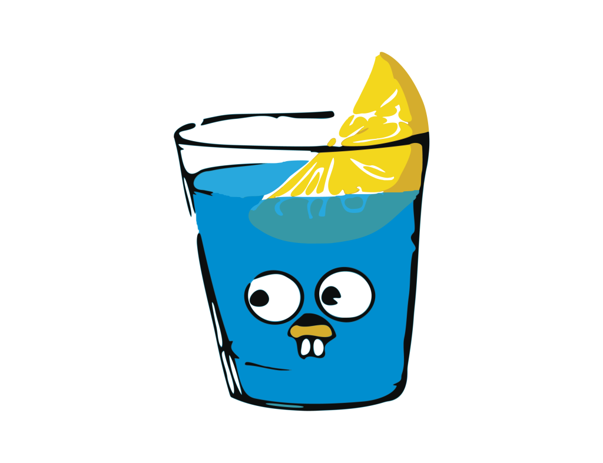

<div align="center">

[](https://github.com/api-golang/banner_gin.png)

</div>

# API em Go

Esta é uma API simples desenvolvida em Go (Golang) usando o framework web Gin.

## Visão Geral

Esta API fornece endpoints para interagir com recursos relacionados a usuários.

## Funcionalidades

- **`GET /getuser/:id`**: Retorna um usuário com o ID correspondente.

## Pré-requisitos

- Go (Golang) instalado em sua máquina. Você pode baixá-lo em [golang.org](https://golang.org/dl/).
- Git instalado em sua máquina. Você pode baixá-lo em [git-scm.com](https://git-scm.com/downloads).

## Configuração

1. Clone este repositório para sua máquina local:

```
git clone https://github.com/seu_usuario/api-go.git
```

2. Navegue até o diretório do projeto:

```
cd api-go
```

3. Inicie a aplicação:

```
go run main.go
```

A aplicação será executada na porta 8080 por padrão. Você pode acessar os endpoints da API em `http://localhost:8080`.

## Uso

Você pode usar qualquer cliente HTTP para interagir com a API, como cURL, Postman ou seu próprio cliente HTTP.

### Exemplo de uso com cURL:

- Obter usuário pelo ID:

```
curl http://localhost:8080/getuser/1
```

## Contribuindo

Contribuições são bem-vindas! Sinta-se à vontade para abrir uma issue para relatar bugs, sugerir melhorias ou enviar pull requests.

## Licença

Este projeto está licenciado sob a [MIT License](LICENSE).
